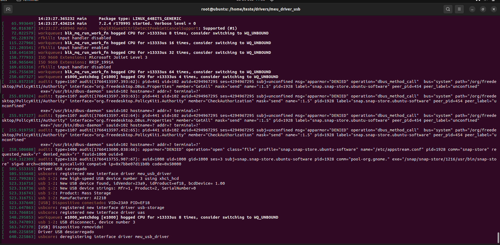

# meu_driver_usb — USB Device Driver

Este diretório contém a implementação de um **driver USB** baseada na seção **5.3.3** do material  
*Técnicas de Programação para Sistemas Embarcados II*.

O objetivo desta prática é demonstrar como criar um **driver USB no espaço de kernel**, capaz de
reconhecer a conexão e desconexão de um dispositivo USB específico (ex.: pen drive), utilizando
os mecanismos fornecidos pelo subsistema USB do Linux.

---

###  Estrutura dos Arquivos

* meu_driver_usb/
* ├── Makefile
* ├── meu_driver.c
* └── meu_driver.h

---

##  Funcionalidades do Módulo

###  Registro de Driver USB

O driver é registrado no kernel utilizando a estrutura `struct usb_driver`, que associa:

- Nome do driver
- Lista de dispositivos suportados
- Funções de **probe** e **disconnect**

O registro e a remoção do driver são feitos através das funções:

- `usb_register()`
- `usb_deregister()`

---

###  Identificação do Dispositivo USB

O subsistema USB identifica dispositivos através de um par de identificadores:

- **idVendor** — identificador do fabricante
- **idProduct** — identificador do dispositivo

Esses IDs são obtidos com o comando:

```bash
lsusb
```

E definidos no arquivo meu_driver.h:

```bash
#define ID_VENDOR  0xXXXX
#define ID_PRODUCT 0xYYYY
```
Esses valores são usados para criar a tabela de dispositivos suportados pelo driver.

---

## Tabela de Dispositivos USB

O driver define uma lista de dispositivos compatíveis usando usb_device_id:

```bash
static struct usb_device_id usb_device_list[] = {
    { USB_DEVICE(ID_VENDOR, ID_PRODUCT) },
    { }
};

```
A macro MODULE_DEVICE_TABLE permite que o kernel carregue automaticamente o módulo quando um dispositivo compatível for conectado.

---

## Funções Probe e Disconnect

#### my_probe()
- Executada automaticamente quando um dispositivo USB compatível é conectado.
- Exibe no log o ID do dispositivo detectado.

#### my_disconnect()
- Executada quando o dispositivo USB é removido da porta.

Essas funções permitem monitorar eventos de conexão e desconexão de dispositivos USB.

---

## Como Compilar

Dentro da pasta meu_driver_usb/ execute:

```bash
make
```
Isso gera o arquivo:

```bash
meu_driver.ko
```

---

## Como Carregar o Módulo

```bash
sudo insmod meu_driver.ko
```

Verifique as mensagens do kernel:
```bash
dmesg -w
```
---

## Como Remover o Módulo

```bash
sudo rmmod meu_driver
```
⚠️ Sempre remova o módulo antes de recompilar ou carregá-lo novamente.

---

## Conflito com Drivers de Armazenamento USB

Ao utilizar um pen drive, pode ocorrer conflito com os módulos padrão do kernel:

- `usb_storage`
- `uas`

Para testes, esses módulos podem ser desabilitados temporariamente adicionando ao arquivo:
```bash
/etc/modprobe.d/blacklist.conf
```

As linhas:
```bash
blacklist usb_storage
blacklist uas
```

Em seguida, remova os módulos carregados:
```bash
sudo rmmod usb_storage
sudo rmmod uas
```
⚠️ Importante: Remova essas entradas da blacklist após finalizar os testes.

---

## Logs Úteis
Para acompanhar os eventos do driver em tempo real:
```bash
dmesg -w
```
Ou:
```bash
tail -f /var/log/syslog
```
---

##  Funcionamento do Character Device Driver

A imagem abaixo demonstra o funcionamento do driver de dispositivo de caractere,
incluindo a criação do device node em `/dev`, operações de leitura e escrita
e as mensagens registradas no log do kernel.



---

##  Referências

- **LDD3 — Linux Device Drivers**  
  https://lwn.net/Kernel/LDD3/

- **Sysplay Linux Drivers Book**  
  https://sysplay.github.io/books/LinuxDrivers/book/

- **Sysplay Drivers Documentation**  
  https://sysplay.in/index.php?pagefile=linux_drivers

---

## Ambiente de Desenvolvimento e Testes

Este módulo foi desenvolvido e testado em uma **máquina virtual Linux**, garantindo um ambiente seguro para compilação e carregamento de módulos de kernel.
